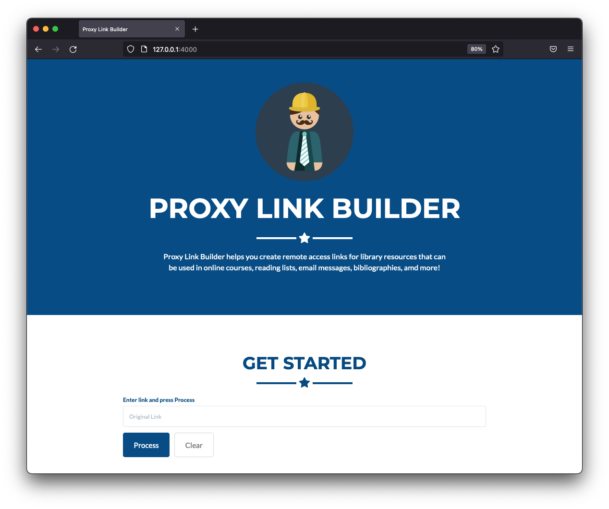

Proxy Link Builder
=========================
A simple JavaScript tool to help create remote access links for library resources that can be used in online courses, reading lists, email messages, bibliographies.

## Usage
* Update settings in `_config.yml` to define a specific institutional instance of this application

## Install
* `git clone` the repository 
* execute `bundle install` to install Ruby gems
* fire up a server on localhost to examine your changes by using `bundle exec jekyll serve`

## References
* Read the [documentation](http://jekyllrb.com/)
* Jekyll theme based on [Freelancer bootstrap theme ](http://startbootstrap.com/template-overviews/freelancer/)